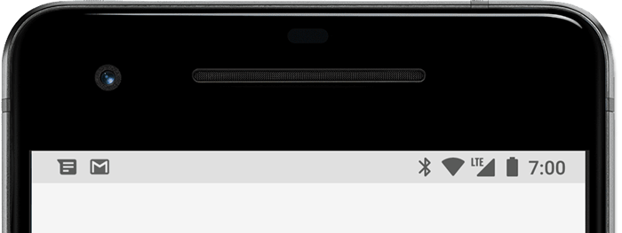
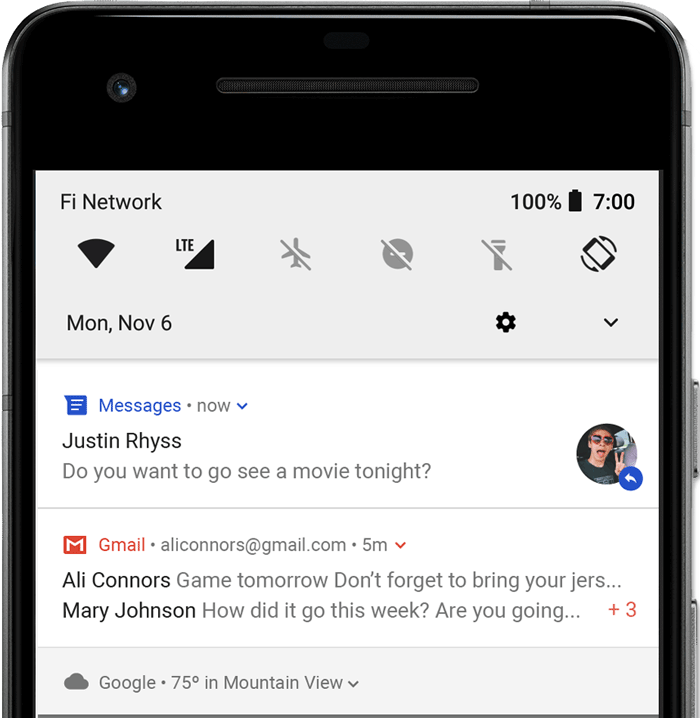
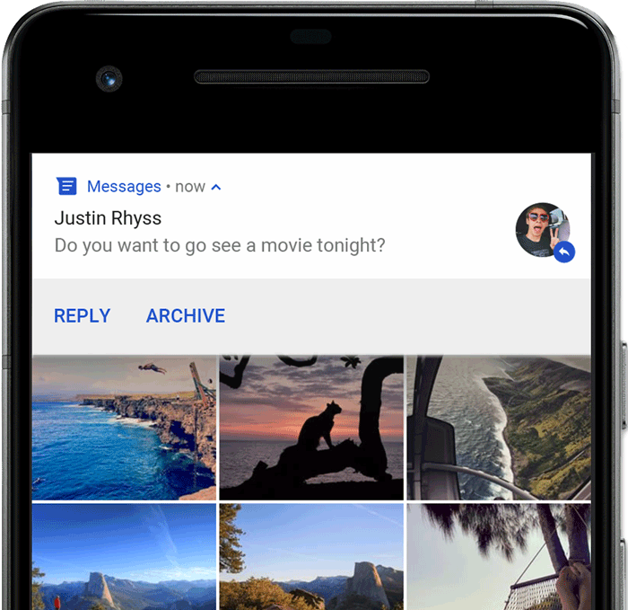

# Notification
##  Giới thiệu
- Notification là một message mà Android sẽ hiển thị bên ngoài Giao diện của app bạn.Mục đích của nó có thể để cung cấp sự nhắc nhở nào đó tới người dùng , tuowng tác với người dùng khác hoặc các thông tin kịp thời khác từ ứng dụng của bạn.
- Người dùng có thể touch vào notification để mở app hoặc thực hiện một hành động trực tiếp nào đó.
- Các cách mà notification có thể xuất hiện trên thiết bị của bạn :
- Status bar và notification drawer :
-Khi bạn tạo một noti, nó sẽ xuất hiện lần đầu dưới dạng icon ở thanh status

- Sau đó bạn có thể vuốt xuống để xem chi tiết và có thể tương tác với noti. Noti sẽ được giữ lại cho đến khi bị hủy bởi app hoặc người dùng
### Heads-up
- Bắt đầu từ Android 5.0, noti có thể xuất hiện nhanh hơn dưới dạng floating-window và gọi là Heads-up noti. Thông báo dạng này thường là quan trọng mà người dùng cần biết ngay lập tức.Cần lưu ý là thông báo này chỉ xuất hiện khi màn hình không ở trong trạng thái khóa.

-Noti này sẽ xuất hiện ngay khi bạn tạo nó, và đồng thời cũng biến mất trong 1 khoảng thời gian rất nhanh.Và đương nhiên nó vẫn được giữ ở 
Notification Drawer, nơi mà bạn có thể vuốt xuống và tương tác với nó. 
-Một số trường hợp mà có thể kích hoạt một heads-up noti :
1.Activity của người dùng ở dạng full screen
2.Notification có độ ưu tiên cao và sử dụng ringtones hoặc vibrations trên Android 7.1 ( Api 25 ) trở xuống 
3.Một noti chanel có độ quan trọng cao trên Android 8.0 trở lên
### Lock screen 
-Bắt đầu từ Android 5.0 , noti có thể xuất hiện trên Lock Srcreen. Bạn có thể cài đặt các mức độ hiển thị cho noti của bạn trên lock screen hoặc cũng có thể hiển thị toàn bộ
-Người dùng cũng có thể sử dụng cài đặt hệ thống để chọn ra các mức hiển thị chi tiết của các noti trên lock screen. Bắt đầu từ Android 8 , người dùng có thể chọn kích hoạt hoặc vô hiệu hóa noti trên lock screen cho mỗi channel.
### App icon badge
- Với các thiết bị chạy Android 8.0 ( Api 26 ) trở lên, icon của app có thể hiện thị các noti mới của app với một "badge" ( hay còn được gọi là noti dot ).
- Người dùng có thể "long click" vào app icon để xem các noti đó.Sau đó họ có thể hủy hoặc tương tác với các noti đó tương tự như trong Noti Drawer.

- Sự tương thích của Noti qua các phiên bản 
- Bắt đầu từ Android 1.0 , Noti UI và Noti Api đã liên tục phát triển. Để sử dụng những tính năng mới nhất của Noti Api trong các thiết bị đã cũ, ta có thể sử dụng Support Lib Noti Api : NotificationCompat và các subclass của nó cũng như là NotificationManagerCompat. Điều này sẽ giúp các bạn tránh khỏi việc phải viết thêm cac code check phiên bản tương ứng vì Api đã làm thay cho bạn.
- NotificationCompat được cập nhật khi các phiên bản nền tảng phát triển, vì vậy chugns luôn có các method mới nhất. Điều quan trọng cần lưu ý  là sự có sẵn của các method trong NotificationCompat cũng không đảm bảo được rằng tính năng tương ứng có được cung cấp trên các thiết bị cũ hay không. Ví dụ như trong class này sẽ có method addAction() cho noti.Tuy nhiên nó chỉ hoạt động trên Android 4.1 trở lên.
### Một số sự thay đổi của Notification qua các phiên bản Android : 
- Android 4.1 ( Api 16 ) : 
1.Notifition Expandable xuất hiện
2.Có thể thêm Action cho noti dưới dạng button
3.Cho phép người dùng bật tắt noti dựa trên setting của mỗi app
- Android 4.4 ( Api 19 , 20 )
1. Notification cho service được hỗ trợ trong Api 
- Android 5.0 ( Api 21 )
1. Giới thiệu notifi lock screen và heads-up noti
2. Người dùng có thể đặt điện thoại vào chế độ Do Not Disturb và cấu hình nó để cho phép noti nào có thể xuất hiện 
3. Method setVisibility() : chỉ định cho sự xuất hiện công khai của noti text khi nó xuất hiện ở lock screen
4. Method setPriority() : method được xuất hiện có tác dụng nói với hệ thống độ ưu tiên của noti này ( ví dụ set là high thì nó sẽ xuát hiện như là heads-up noti ) 

