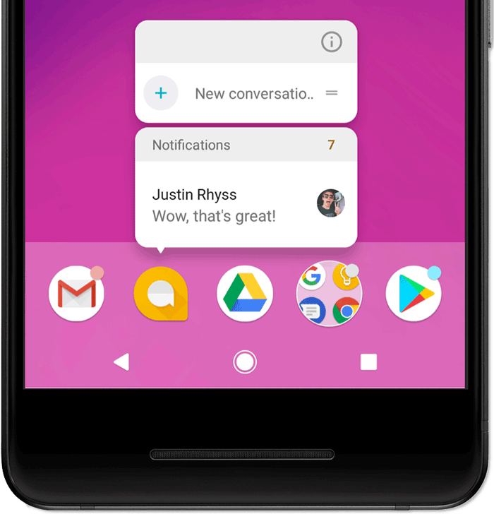
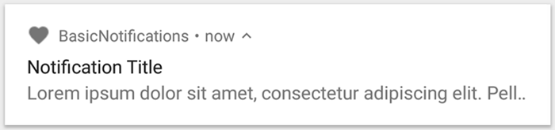
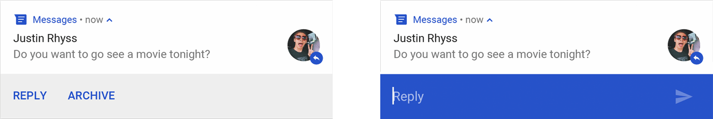
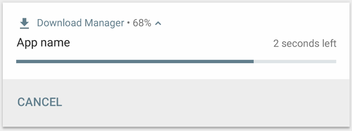
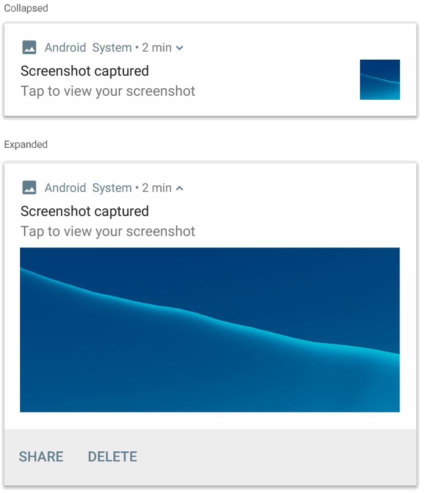
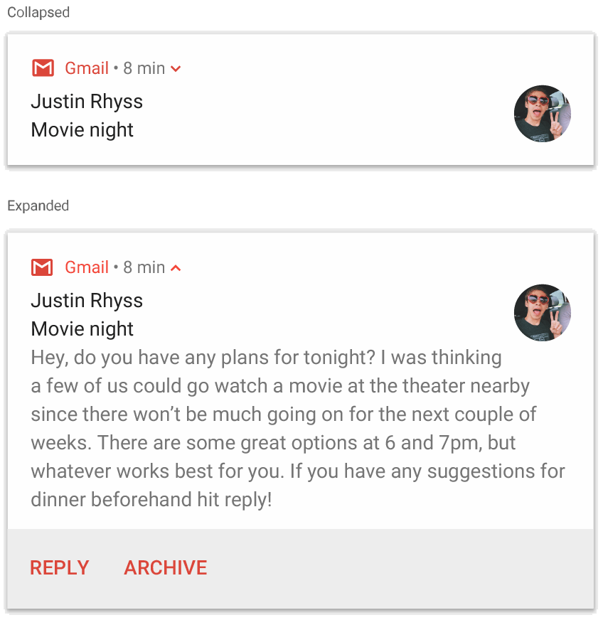
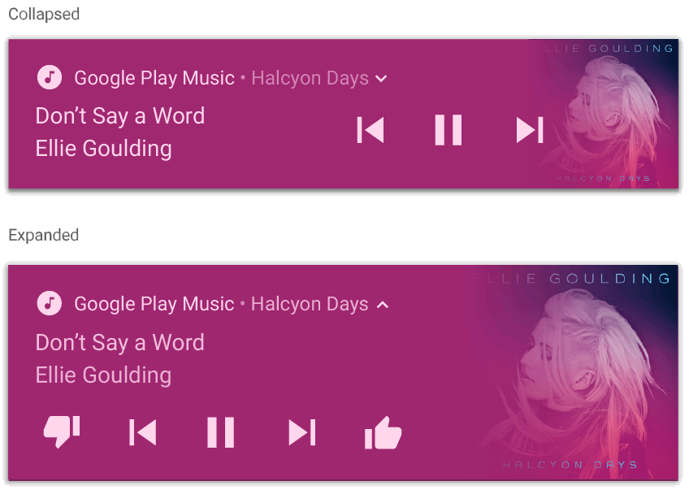
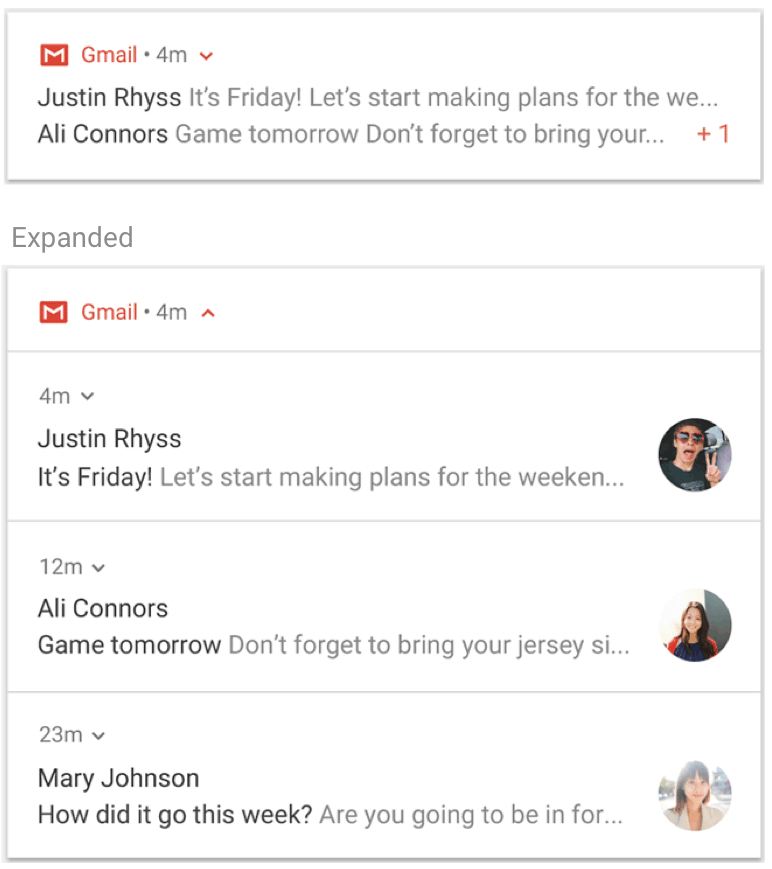
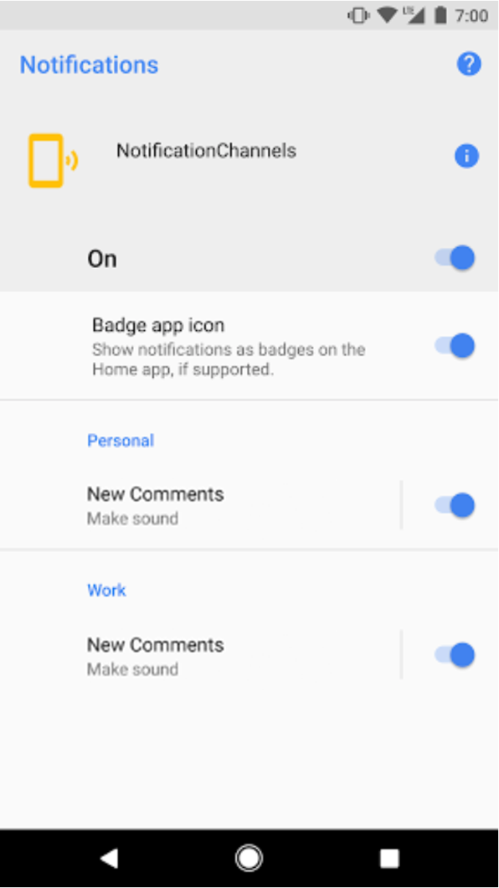

# Notification
##  Giới thiệu
- Notification là một message mà Android sẽ hiển thị bên ngoài Giao diện của app bạn.Mục đích của nó có thể để cung cấp sự nhắc nhở nào đó tới người dùng , tuowng tác với người dùng khác hoặc các thông tin kịp thời khác từ ứng dụng của bạn.
- Người dùng có thể touch vào notification để mở app hoặc thực hiện một hành động trực tiếp nào đó.
- Các cách mà notification có thể xuất hiện trên thiết bị của bạn :
- Status bar và notification drawer :
-Khi bạn tạo một noti, nó sẽ xuất hiện lần đầu dưới dạng icon ở thanh status

- Sau đó bạn có thể vuốt xuống để xem chi tiết và có thể tương tác với noti. Noti sẽ được giữ lại cho đến khi bị hủy bởi app hoặc người dùng
### Heads-up
- Bắt đầu từ Android 5.0, noti có thể xuất hiện nhanh hơn dưới dạng floating-window và gọi là Heads-up noti. Thông báo dạng này thường là quan trọng mà người dùng cần biết ngay lập tức.Cần lưu ý là thông báo này chỉ xuất hiện khi màn hình không ở trong trạng thái khóa.

-Noti này sẽ xuất hiện ngay khi bạn tạo nó, và đồng thời cũng biến mất trong 1 khoảng thời gian rất nhanh.Và đương nhiên nó vẫn được giữ ở 
Notification Drawer, nơi mà bạn có thể vuốt xuống và tương tác với nó. 

-Một số trường hợp mà có thể kích hoạt một heads-up noti :

1.Activity của người dùng ở dạng full screen

2.Notification có độ ưu tiên cao và sử dụng ringtones hoặc vibrations trên Android 7.1 ( Api 25 ) trở xuống

3.Một noti chanel có độ quan trọng cao trên Android 8.0 trở lên

### Lock screen 
-Bắt đầu từ Android 5.0 , noti có thể xuất hiện trên Lock Srcreen. Bạn có thể cài đặt các mức độ hiển thị cho noti của bạn trên lock screen hoặc cũng có thể hiển thị toàn bộ

-Người dùng cũng có thể sử dụng cài đặt hệ thống để chọn ra các mức hiển thị chi tiết của các noti trên lock screen. Bắt đầu từ Android 8 , người dùng có thể chọn kích hoạt hoặc vô hiệu hóa noti trên lock screen cho mỗi channel.
### App icon badge
- Với các thiết bị chạy Android 8.0 ( Api 26 ) trở lên, icon của app có thể hiện thị các noti mới của app với một "badge" ( hay còn được gọi là noti dot ).

- Người dùng có thể "long click" vào app icon để xem các noti đó.Sau đó họ có thể hủy hoặc tương tác với các noti đó tương tự như trong Noti Drawer.

- Sự tương thích của Noti qua các phiên bản 

- Bắt đầu từ Android 1.0 , Noti UI và Noti Api đã liên tục phát triển. Để sử dụng những tính năng mới nhất của Noti Api trong các thiết bị đã cũ, ta có thể sử dụng Support Lib Noti Api : NotificationCompat và các subclass của nó cũng như là NotificationManagerCompat. Điều này sẽ giúp các bạn tránh khỏi việc phải viết thêm cac code check phiên bản tương ứng vì Api đã làm thay cho bạn.

- NotificationCompat được cập nhật khi các phiên bản nền tảng phát triển, vì vậy chugns luôn có các method mới nhất. Điều quan trọng cần lưu ý  là sự có sẵn của các method trong NotificationCompat cũng không đảm bảo được rằng tính năng tương ứng có được cung cấp trên các thiết bị cũ hay không. Ví dụ như trong class này sẽ có method addAction() cho noti.Tuy nhiên nó chỉ hoạt động trên Android 4.1 trở lên.
### Một số sự thay đổi của Notification qua các phiên bản Android : 
### Android 4.1 ( Api 16 ) : 
- Notifition Expandable xuất hiện
- Có thể thêm Action cho noti dưới dạng button
- Cho phép người dùng bật tắt noti dựa trên setting của mỗi app
### Android 4.4 ( Api 19 , 20 )
- Notification cho service được hỗ trợ trong Api 
### Android 5.0 ( Api 21 )
- Giới thiệu notifi lock screen và heads-up noti
- Người dùng có thể đặt điện thoại vào chế độ Do Not Disturb và cấu hình nó để cho phép noti nào có thể xuất hiện 
- Method setVisibility() : chỉ định cho sự xuất hiện công khai của noti text khi nó xuất hiện ở lock screen
- Method setPriority() : method được xuất hiện có tác dụng nói với hệ thống độ ưu tiên của noti này ( ví dụ set là high thì nó sẽ xuát hiện như là heads-up noti ) 
### Android 7.0 ( Api 24 )
- Có 3 mẫu notification mới : 1 cho messaging app, và 2 cho custom content view
- Có notification group
- Người dùng có thể trả lời trực tiếp từ notification ( nhập vào text từ khung reply )
### Android 8.0 ( Api 26 ) 
- Các thông báo cá nhân bị bắt buộc đặt vào một channel
- Người dùng bây giờ có thể vô hiệu hóa noti theo channel thay vì vô hiệu hóa toàn bộ noti của app
- Có thể tương tác với noti qua app icon
- Có thể set màu background cho notification
- Một số Api liên quan đến hành vi của notification bị chuyển từ Notification sang NotificationChannel : ví dụ ở các ver trước NotificationCompat.Builder.setPriority() để set độ ưu tiên cho noti. Nhưng từ Android 8 sẽ là NotificationChannel.setImportance()

## Tạo Notification
- Những cách làm sau đây sẽ sử dụng API thuộc NotificationCompat từ Android support lib.Các Api này cho phép bạn thêm các tính năng mới mà chỉ có sẵn trên các phiên bản mới lên các thiết bị cũ mà vẫn tương thích với nhau. Tất nhiên vẫn có các tính năng sẽ không được hỗ trợ, ví dụ reply trên noti từ Android 7 sẽ không được dung với Android 4.
### Tạo Notification cơ bản

- Sử dụng đối tượng NotificationCompat.Builder 

        NotificationCompat.Builder mBuilder = new NotificationCompat.Builder(this, CHANNEL_ID)
                .setSmallIcon(R.drawable.notification_icon)
                .setContentTitle(textTitle)
                .setContentText(textContent)
                .setPriority(NotificationCompat.PRIORITY_DEFAULT);
                
- Lưu ý Builder sẽ yêu cầu tham số là CHANNEL_ID để tương thích với Android 8 trở lên. Còn với các phiên bản thấp hơn nó sẽ được bỏ qua.
	
- Như bình thường content của notification chỉ hiển thị trong 1 dòng.Nếu bạn muốn notifi được dài hơn thì có thể kích hoạt expandable notification với setStyle()

        .setContentText("Much longer text that cannot fit one line...")
        .setStyle(new NotificationCompat.BigTextStyle()
                .bigText("Much longer text that cannot fit one line..."))
                
- Tạo Channel và cài đặt độ quan trọng
- Trước khi bạn có thể thực hiện chuyển 1 notification trên Android 8, bạn phải đăng kí Notification Channel của app bạn với hệ thống bằng cách truyền một thể hiện của NotificationChannel  cho method  createNotificationChannel() 

        if (Build.VERSION.SDK_INT >= Build.VERSION_CODES.O) {
            // Create the NotificationChannel, but only on API 26+ because
            // the NotificationChannel class is new and not in the support library
            CharSequence name = getString(R.string.channel_name);
            String description = getString(R.string.channel_description);
            int importance = NotificationManagerCompat.IMPORTANCE_DEFAULT;
            NotificationChannel channel = new NotificationChannel(CHANNEL_ID, name, importance);
            channel.setDescription(description);
            // Register the channel with the system
            NotificationManagerCompat notificationManager = NotificationManagerCompat.from(this);
            notificationManager.createNotificationChannel(channel);
        }
 - Thêm action cho notification 
 
       // Create an explicit intent for an Activity in your app
        Intent intent = new Intent(this, AlertDetails.class);
        intent.setFlags(Intent.FLAG_ACTIVITY_NEW_TASK | Intent.FLAG_ACTIVITY_CLEAR_TASK);
        PendingIntent pendingIntent = PendingIntent.getActivity(this, 0, intent, 0);
          // Set the intent that will fire when the user taps the notification
              .setContentIntent(pendingIntent)
              .setAutoCancel(true);
              
-  Nếu bạn để autoCancel(true) thì noti sẽ tự biên mất sau khi người dùng click vào nó

- Hiển thị notification

        NotificationManagerCompat notificationManager = NotificationManagerCompat.from(this);

      // notificationId is a unique int for each notification that you must define
      notificationManager.notify(notificationId, mBuilder.build());
-  Dùng manager, truyền vào id của notifiation ( không trùng lặp ) và builder. 
-  Lưu ý : id bạn truyền vào cho noti cần phải lưu lại để có thể thông qua nó để update hay remove noti sau này nếu bạn cần 

### Thêm action cho notification 
- Thêm một PendingIntent vào notification với method : addAction(). Hoạt động ở đây có thể mở 1 activity hoặc khởi động một BroadcastReceiver để thực hiện một task background mà không làm gián đoạn app hiện tại đang mở.
- Ví dụ : send Broadcast vơi notification

        Intent snoozeIntent = new Intent(this, MyBroadcastReceiver.class);
      snoozeIntent.setAction(ACTION_SNOOZE);
      snoozeIntent.putExtra(EXTRA_NOTIFICATION_ID, 0);
      PendingIntent snoozePendingIntent =
              PendingIntent.getBroadcast(this, 0, snoozeIntent, 0);
              
              
              NotificationCompat.Builder mBuilder = new NotificationCompat.Builder(this, CHANNEL_ID)
        .setSmallIcon(R.drawable.notification_icon)
        .setContentTitle("My notification")
        .setContentText("Hello World!")
        .setPriority(NotificationCompat.PRIORITY_DEFAULT)
        .setContentIntent(pendingIntent)
        .addAction(R.drawable.ic_snooze, getString(R.string.snooze),
                snoozePendingIntent);
                
  ### Thêm action directly reply
-  Action này có từ Android 7.0 , cho phép người dùng có thể trực tiếp nhâp vào text từ notification

- Nội dung mà bạn nhập vào sẽ được thêm vào intent mà bạn gán cho action của notification và gửi intent đến app của chúng ta.
#### Thêm reply button 
- Tạo một thể hiện của RemoteInput.Builder để thêm vào action của Noti. Contructor của class này nhận vào 1 string .String này sẽ được hệ thống dùng như là key cho đoạn text bạn nhập vào. Sau đó , khi app nhận intent, bạn có thể lấy ra text nhập vào bằng string này.

          private static final String KEY_TEXT_REPLY = "key_text_reply";

      String replyLabel = getResources().getString(R.string.reply_label);
      RemoteInput remoteInput = new RemoteInput.Builder(KEY_TEXT_REPLY)
              .setLabel(replyLabel)
              .build();
- Tạo PendingIntent cho action reply

          // Build a PendingIntent for the reply action to trigger.
          PendingIntent replyPendingIntent =
                  PendingIntent.getBroadcast(getApplicationContext(),
                          conversation.getConversationId(),
                          getMessageReplyIntent(conversation.getConversationId()),
                          PendingIntent.FLAG_UPDATE_CURRENT);
- Cảnh báo  :  Nếu sử dụng lại PendingIntent, thì người dùng có thể sẽ trả lời vào cuộc hội thoại khác mà họ có thể không biết. < Xem lại phần PendingIntent ở trên > Khi chúng ta dùng một PendingInTent với các Intent khác nhau cho cùng một mục đích, ví dụ trường hợp này ta chỉ thay 2 intent cho 2 cuộc hội thoại vào PendingIntent này. Tuy nhiên với 2 intent cùng mục đích như thế này, hệ thống sẽ equal nó là true khi bạn chỉ thay đổi nội dung extra ( lúc này là tin nhắn ) kèm theo nó. Vì vậy cần phải làm hệ thống xem 2 intent này là khác nhau khi equal bằng cách làm cho chúng khác nhau 1 trong các thành phần chính trừ extra.Hoặc đơn giản mỗi intent sẽ có requestcode khác nhau, như ví dụ trên là truyền vào id của cuộc hội thoại.
- Đính RemoteInput vào action với method addRemoteInput() 

        // Create the reply action and add the remote input.
        NotificationCompat.Action action =
                new NotificationCompat.Action.Builder(R.drawable.ic_reply_icon,
                        getString(R.string.label), replyPendingIntent)
                        .addRemoteInput(remoteInput)
                        .build();
                      
- Thêm action vào noti và show 

          // Build the notification and add the action.
          Notification newMessageNotification = new Notification.Builder(mContext, CHANNEL_ID)
                  .setSmallIcon(R.drawable.ic_message)
                  .setContentTitle(getString(R.string.title))
                  .setContentText(getString(R.string.content))
                  .addAction(action)
                  .build();
          // Issue the notification.
          NotificationManagerCompat notificationManager = NotificationManagerCompat.from(this);
          notificationManager.notify(notificationId, newMessageNotification);
- Nhận data reply 
- Truyền intent bạn nhận được bởi Broadcast cho method sau  : RemoteInput.getResultsFromIntent() 

        private CharSequence getMessageText(Intent intent) {
        Bundle remoteInput = RemoteInput.getResultsFromIntent(intent);
          if (remoteInput != null) {
              return remoteInput.getCharSequence(KEY_TEXT_REPLY);
          }
          return null;
       }
- Sau khi bạn đã xử lý nội dung nhận được thì nên update lại notification để ẩn đi khung reply đồng thời cũng thông báo cho người dùng text của họ đã được gửi thành công. Ta sẽ tạo noti mới nhưng với cùng id với noti cũ để hủy cái cũ thay bằng noti mới này 

        // Build a new notification, which informs the user that the system
        // handled their interaction with the previous notification.
        Notification repliedNotification = new Notification.Builder(context, CHANNEL_ID)
                .setSmallIcon(R.drawable.ic_message)
                .setContentText(getString(R.string.replied))
                .build();

        // Issue the new notification.
        NotificationManagerCompat notificationManager = NotificationManagerCompat.from(this);
        notificationManager.notify(notificationId, repliedNotification);
 
- Lưu ý context dùng cho noti mới này ta lấy từ method onReceiver của BroadcastREceiver

### Thêm ProgressBar 

- Nếu bạn có thể tước tính được khối lượng công việc hoàn thành tại bất kì thời điểm nào thì có thể dùng progressBar.
- Dùng method : setProgress( max , progress, false ) : 

          NotificationManagerCompat notificationManager = NotificationManagerCompat.from(this);
          NotificationCompat.Builder mBuilder = new NotificationCompat.Builder(this, CHANNEL_ID);
          mBuilder.setContentTitle("Picture Download")
                  .setContentText("Download in progress")
                  .setSmallIcon(R.drawable.ic_notification)
                  .setPriority(NotificationCompat.PRIORITY_LOW);

          // Issue the initial notification with zero progress
          int PROGRESS_MAX = 100;
          int PROGRESS_CURRENT = 0;
          mBuilder.setProgress(PROGRESS_MAX, PROGRESS_CURRENT, false);
          notificationManager.notify(notificationId, mBuilder.build());

          // Do the job here that tracks the progress.
          // Usually, this should be in a worker thread
          // To show progress, update PROGRESS_CURRENT and update the notification with:
          // mBuilder.setProgress(PROGRESS_MAX, PROGRESS_CURRENT, false);
          // notificationManager.notify(notificationId, mBuilder.build());

          // When done, update the notification one more time to remove the progress bar
          mBuilder.setContentText("Download complete")
                  .setProgress(0,0,false);
          notificationManager.notify(notificationId, mBuilder.build());
-Khi hoạt động chạy xong, chúng ta có thể hủy thanh progress với method setProgress(0, 0, false) 

- Do progressBar cập nhật notification liên tục , đoạn code này nên chạy ở background.

-Tham số Boolean cuối trong method setProgress() :
True : 
	ProgressBar sẽ không hiển thị % hoàn thành, giống hình ví dụ trên đầu.
False 
	Có hiển thị % 

- Nếu cần làm download thì dùng DownloadManager, sẽ tự có notification của nó

### Hiển thị notification trên lock screen
- Một notification khi hiển thị ở lock screen sẽ có mức độ hiện thị của nó.Ví dụ ta không muốn hiển thị nội dung tin nhắn, mà chỉ muốn thấy thông báo có tin nhắn chẳng hạn

- Sử dụng setVisibility() và chỉ định một trong các giá trị sau :

- VISIBILITY_PUBLIC : hiển thị toàn bộ notification cùng nội dung của nó.
- VISIBILITY_SECRET không hiển thị bất kì phần nào của noti này
- VISIBILITY_PRIVATE chỉ hiển thị thông tin cơ bản như icon hay title.Nội dung sẽ bị ẩn.

- Khi bạn dùng PRIVATE,  bạn cũng có thể cung cấp nội dung hiển thị thay thế.VÍ dụ khi có tin nhắn nhưng sẽ không show nó ra mà chỉ show bạn có xxx tin nhắn mới.Chúng ta sẽ tạo Builder như bình thường và sẽ thêm vào setPublicVersion().

### Cập nhật notification 
- Để udpate một noti đã thực hiện thông báo, ta sẽ gọi lại NotificationManagerCompat.notify() và truyền vào Id của noti cũ muốn cập nhật.Nếu noti cũ đã bị hủy thì một noti mới với cùng id sẽ được tạo.

- Bạn cũng có thể thêm setOnlyAlertOnce() cho noti.Nó cho phép thông báo đến nguwoif dùng với thông báo dạng âm thanh hay rung lần duy nhất.Các lần update sau sẽ không có.

- Lưu ý : khi bạn update quá nhiều noti ( thường là tính trong vòng 1s ) thì hệ thống sẽ bỏ qua một vài update của bạn

### Xóa notification
- Một notification sẽ tồn tại cho đến khi :
1. Người dùng vuốt hủy nó
2. Người dùng click vào nó trong khi bạn đã setAutoCancel() khi tạo noti
3. Bạn gọi cancel() với một noti id cụ thể
4. Bạn gọi cancelAll() sẽ hủy toàn bộ các noti trước đó
5. Nếu setTimeoutAfter() khi tạo noti, hệ thống sẽ tự hủy nó sau time nhất định

### Tạo Expandable Notification
- Để cung cấp nhiều thông tin hơn với notification, ta có thể tạo 1 basic notificaiton, sau đó setStyle() với các style sau :

        .setStyle(new NotificationCompat.BigPictureStyle()
               .bigPicture(myBitmap))
- Để làm cho image xuất hiện như một thumbnail chỉ khi noti được collapse, ta sẽ gọi setLargeIcon() và truyền vào ảnh , tuy nhiên vẫn gọi  BigPictureStyle.bigLargeIcon() và truyền vào null như sau 

          .setLargeIcon(myBitmap)
          .setStyle(new NotificationCompat.BigPictureStyle()
                          .bigPicture(myBitmap)
                          .bigLargeIcon(null))

### Thêm 1 block cho text
- Thêm Style NotificationCompat.BigTextStyle 

        .setStyle(new NotificationCompat.BigTextStyle()
                .bigText(emailObject.getSubjectAndSnippet()))
                

- Để thêm định dạng như B,I,U cho text, có thể dùng https://developer.android.com/guide/topics/resources/string-resource#StylingWithHTML

### Tạo inbox-style notification
- Sử dụng NotificationCompat.InboxStyle 
- Chỉ hiện thị 6 line, nếu nhiều hơn chỉ 6 line đầu được hiển thị

        .setStyle(new NotificationCompat.InboxStyle()
                        .addLine(messageSnippet1)
                        .addLine(messageSnippet2))
###  Hiển thị hội thoại trong 1 notification
- Sử dụng NotificationCompat.MessagingStyle 

- Hiển thị các tin nhắn tuần tự giữa bất kì số lượng người nào.Mỗi mes sẽ có nội dung, tên người gửi, và nội dung có thể hiển thị trên nhiều dòng tương tự như app chat 

        NotificationCompat.MessagingStyle.Message message1 =
        new NotificationCompat.MessagingStyle.Message(messages[0].getText(),
                                                      messages[0].getTime(),
                                                      messages[0].getSender());
        NotificationCompat.MessagingStyle.Message message2 =
                new NotificationCompat.MessagingStyle.Message(messages[1].getText(),
                                                              messages[1].getTime(),
                                                              messages[1].getSender());
         Notification notification = new NotificationCompat.Builder(mContext, CHANNEL_ID)
        .setSmallIcon(R.drawable.new_message)
        .setStyle(new NotificationCompat.MessagingStyle(resources.getString(R.string.reply_name))
                .addMessage(message1)
                .addMessage(message2))
        .build();
                    

                                                              
### Tạo notification với media controls 
 - Sử dụng NotificationCompat.MediaStyle 
 - Chúng ta sẽ gọi addAction() 5 lần để hiển thị 5 nút riêng biệt.Sau đó thêm setLargeIcon() để set ảnh album
 - Khác với khác notification style khác, MediaStyle cho phép chỉnh sửa nội dung của noti khi được collapse .Ví dụ muốn khi noti collapse mà vẫn hiển thị button nào đó thì ta thêm action button đó vào method setShowActionsInCompactView()
- Nếu notifi của bạn đang thông báo thông tin media như dạng này, ta có thể thêm MediaSession.Token cho nó với setMediaSession(). Sau đó android sẽ xác định được đây là dạng media noti và sẽ có các xử lý tương ứng ( giả sử như album image khi noti ở lock screen ) 

         Notification notification = new NotificationCompat.Builder(context, CHANNEL_ID)
        // Show controls on lock screen even when user hides sensitive content.
        .setVisibility(NotificationCompat.VISIBILITY_PUBLIC)
        .setSmallIcon(R.drawable.ic_stat_player)
        // Add media control buttons that invoke intents in your media service
        .addAction(R.drawable.ic_prev, "Previous", prevPendingIntent) // #0
        .addAction(R.drawable.ic_pause, "Pause", pausePendingIntent)  // #1
        .addAction(R.drawable.ic_next, "Next", nextPendingIntent)     // #2
        // Apply the media style template
        .setStyle(new NotificationCompat.MediaStyle()
                .setShowActionsInCompactView(1 /* #1: pause button */)
                .setMediaSession(mMediaSession.getSessionToken()))
        .setContentTitle("Wonderful music")
        .setContentText("My Awesome Band")
        .setLargeIcon(albumArtBitmap)
        .build();
                                                   
                                                              
- Khi một noti được tạo với style này nó sẽ được mặc định là CATEGORY_TRANSPOT trừ khi bạn setCategory() lại cho nó.
https://developer.android.com/guide/topics/media-apps/audio-app/building-a-mediabrowserservice#mediastyle-notifications

## Mở Activity từ Notifycation
- Khi bạn mở một activity từ notification thì phải giữ được trải nghiệm điều hướng của người dùng.
	
- Tùy thuộc vào 2 loại activity sau khi bạn muốn mở, chúng ta sẽ build PendingIntent phù hợp cho chúng :
- Activity bình thường :  Đây là act tồn tại như là một phần luồng giao diện của app bạn.Vậy khia người dùng chuyển đến act này từ notification, task mới nên chứa tất cả các activity cũ trong back stack mà nguwoif dùng đã sử dụng. Bây giờ thì sẽ cho phép ấn back để quay lại các act trước đó.
	- Activity đặc biệt : Activity này không xuất hiện 1 cách bình thường trong app của bạn. Tức là bạn chỉ có thể mở nó từ notification 

### Cài đặt PendingIntent mở Activity thông thường
- Để mở một activity thông thường từ notification , thiết lập PendingIntent với TaskStackBuilder để tạo một backstack mới.
- Định nghĩa activity trong Manifest với thuộc tính android:parentActivityName 

        <activity
          android:name=".MainActivity"
          android:label="@string/app_name" >
          <intent-filter>
              <action android:name="android.intent.action.MAIN" />
              <category android:name="android.intent.category.LAUNCHER" />
          </intent-filter>
      </activity>
      <!-- MainActivity is the parent for ResultActivity -->
        <activity
            android:name=".ResultActivity"
            android:parentActivityName=".MainActivity" />
            ...
        </activity>

-Build PendingIntent với backstack
-	Tạo một thể hiện của TaskStackBuilder và gọi addNextIntentWithParentStack() , truyền Intent dùng để chuyển đến activity bạn mong muốn

-	Miễn là bạn đã định nghĩa parentActivity như trên cho mỗi activity , bạn có thể gọi getPendingIntent() để nhận về PendingIntent chứa toàn bộ back stack của bạn.

        // Create an Intent for the activity you want to start
        Intent resultIntent = new Intent(this, ResultActivity.class);
        // Create the TaskStackBuilder and add the intent, which inflates the back stack
        TaskStackBuilder stackBuilder = TaskStackBuilder.create(this);
        stackBuilder.addNextIntentWithParentStack(intent);
        // Get the PendingIntent containing the entire back stack
        PendingIntent resultPendingIntent =
                stackBuilder.getPendingIntent(0, PendingIntent.FLAG_UPDATE_CURRENT);

-Nếu cần thiết , có thể thêm tham số cho Intent trong stack bằng cách gọi TaskStackBuilder.editIntentAt(). Điều này đôi khi sẽ cần thiết để chắc chắn rằng activity đó ở trong back stack hiển thị dữ liệu có ý nghĩa khi người dùng chuyển đến nó.

- Sau đó thì có thể truyền PendingIntent cho Notification như bình thường  ;

          NotificationCompat.Builder builder = new NotificationCompat.Builder(this, CHANNEL_ID);
        builder.setContentIntent(resultPendingIntent);
        ...
        NotificationManagerCompat notificationManager = NotificationManagerCompat.from(this);
        notificationManager.notify(NOTIFICATION_ID, builder.build());

### Cài đặt PendingIntent mở Activity đặc biệt
- Bởi vì một activity đặc biệt chạy từ notification không cần đến back stack , bạn có thể tạo PendingIntent bằng cách gọi getActivity() , nhưng bạn nên chắc chắn rằng đã định nghĩa task thích hợp trong Manifest.

- Ở trong thẻ <activity> ta sẽ định nghĩa các attr sau : 

          android:taskAffinity=""
- Kết hợp với flag  FLAG_ACTIVITY_NEW_TASK bạn sẽ sử dụng ở trong code, để value của attr này trống để chắc chắn activity này không đi vào task mặc định của app.Bất kì những app nào so attr này mà k để trống như trên thì sẽ khong bị ảnh hưởng.

          android:excludeFromRecents="true"
- Khi dùng attr này , các task gần đây sẽ được tách biệt với act này, bạn sẽ không thể back lại nó. 

        <activity
          android:name=".ResultActivity"
          android:launchMode="singleTask"
          android:taskAffinity=""
          android:excludeFromRecents="true">
      </activity>
- Tạo PendingIntent  :

- Tạo intent se chạy activity
- Set flag như nói trên cho intent : FLAG_ACTIVITY_NEW_TASK hoặc FLAG_ACTIVITY_CLEAR_TASK với setFlag()
- Tạo PendingIntent với method getActivity()

           Intent notifyIntent = new Intent(this, ResultActivity.class);
          // Set the Activity to start in a new, empty task
          notifyIntent.setFlags(Intent.FLAG_ACTIVITY_NEW_TASK
                              | Intent.FLAG_ACTIVITY_CLEAR_TASK);
          // Create the PendingIntent
          PendingIntent notifyPendingIntent = PendingIntent.getActivity(
                  this, 0, notifyIntent, PendingIntent.FLAG_UPDATE_CURRENT
          );
           
 - Thêm PendingIntent cho Notification : 
                         
          NotificationCompat.Builder builder = new NotificationCompat.Builder(this, CHANNEL_ID);
          builder.setContentIntent(notifyPendingIntent);
          ...
          NotificationManagerCompat notificationManager = NotificationManagerCompat.from(this);
          notificationManager.notify(NOTIFICATION_ID, builder.build());

## Tạo notification group
- Được xuất hiện từ Android 7.0 ( Api 24 ) , bạn có thể hiển thị các noti có liên quan tới nhau trong một nhóm.Ví dụ app của bạn hiển thị thông báo về mail đã nhận , bạn nên để tất cả những thông báo đó trong cùng 1 nhóm để nguwoif dùng có thể thu gọn chúng lại cùng nhau
     
- Để tạo một group , cần định nghĩa các string không trùng lặp cho group đó.Sau đó với mỗi notification bạn muốn nó ở trong group , chỉ cần gọi method setGroup() và truyền vào tên group 

          String GROUP_KEY_WORK_EMAIL = "com.android.example.WORK_EMAIL";

          Notification newMessageNotification = new NotificationCompat.Builder(MainActivity.this, CHANNEL_ID)
                  .setSmallIcon(R.drawable.new_mail)
                  .setContentTitle(emailObject.getSenderName())
                  .setContentText(emailObject.getSubject())
                  .setLargeIcon(emailObject.getSenderAvatar())
                  .setGroup(GROUP_KEY_WORK_EMAIL)
                  .build();
  - Theo mặc định , notification sẽ được sắp xếp dựa theo thứ tự nó được post , nhưng có thể thay đổi với method setSortKey()
##  Notification Channel
- Bắt đầu từ Android 8.0 , tất cả các noti đều phải được đăng kí vào channel.Với mỗi channel , bạn có thể thực hiện các cài đặt áp dụng cho tất cả các noti thuộc channel đó. Sau đó, người dùng có thể thay đổi những cài đặt này cũng như quyết định xem channel nào của app bạn sẽ được hiển thị.
- Người dùng có thể thực hiện cài đặt cho tất cả các channel noti có sẵn trong mỗi app trong cài đặt hệ thống như hình sau : 

   
- Sau khi tạo ra một noti channel bạn sẽ không thay đổi được hành vi của nó nữa.Nguời dùng sẽ hoàn toàn kiểm soát và bạn chỉ có thể thay đổi tên cũng như mô tả của channel thôi
	
- Bạn nên tạo các channel cho mỗi loại noti riêng biêt mà bạn muốn gửi.Bạn cũng nên tạo các channel riêng ứng với các lựa chọn của người dùng app.Giả sử với app chat.Khi người dùng tạo nhóm chat chúng ta sẽ tạo riêng channel cho nhóm này. Khi user out nhóm và không muốn nhận tin nhắn tự nhóm thì chỉ cần tắt channel.
- Khi project target Android 8, bạn cần thực hiện ít nhất là 1 channel.Nếu targetSdkVersion được đặt là 25 hoặc thấp hơn , khi app được chạy trên Android 8.0 hoặc cao hơn thif nó vẫn hoặt động giống như trên Android 7 ( Api 25 ) trở xuống
- Cảnh báo : Nếu target Android 8 mà không chỉ định 2 chanel thì noti của bạn sẽ không được hiển thị và hệ thống sẽ báo lỗi
- Bạn có thể bật một cài đặt mới trên Android 8 : Khi mà app cố gắng hiển thị một noti mà không có channel thf hệ thống sẽ hiển thị thông báo trên màn hình dạng toast với cài đặt này. Vào Setting -> Developer options -> Bật Show notification channel warning 

###  Tạo channel
- Các bước :
1.Khởi tạo NotificationChanel với ID riêng biệt k trùng nhau , tên người dùng , và mức đọ quan trọng của channel
2.TÙy chọn thêm, chỉ định mô tả mà người dùng cos thể nhìn thấy trong cài đặt hệ thống với setDescription()
3.Đăng kí channel bằng cách truyền nó vào method createNotificationChannel().

- Bạn nên thực hiên các bước code trên trong một điều kiện của SDK ver để chắc chắn rằn bạn sẽ chạy nó chỉ với Android 8.0 trở nên.Các phiên bản thấp hơn sẽ không được hỗ trợ channel.

        if (Build.VERSION.SDK_INT >= Build.VERSION_CODES.O) {
        // Create the NotificationChannel
        CharSequence name = getString(R.string.channel_name);
        String description = getString(R.string.channel_description);
        int importance = NotificationManager.IMPORTANCE_DEFAULT;
        NotificationChannel mChannel = new NotificationChannel(CHANNEL_ID, name, importance);
        mChannel.setDescription(description);
        // Register the channel with the system; you can't change the importance
        // or other notification behaviors after this
        NotificationManager notificationManager = (NotificationManager) getSystemService(
                NOTIFICATION_SERVICE);
        notificationManager.createNotificationChannel(mChannel);
      }
- Chúng ta hoàn toàn có thể tạo sẵn ra các channel với nhưng giá trị ban dầu chưa nhằm thực hiện hành động gì.VÌ vậy đoạn code trên an toàn khi gọi lúc app khởi động.

-	Theo mặc định, tất cả các noti thuộc một channel sẽ sử dụng những thiết lập đã có cảu channel . Nếu bạn cần tùy chỉnh các hành vi thông báo của noti trong channel thì có thể gọi enableLights(), setLightColor(), and setVibrationPattern() trên NotificationChannel. TUy nhiên lưu ý là khi Channel đã được tạo thì bạn không thể thay đổi những cài đặt này nữa.Lúc này người dùng sẽ toàn quyền quyết định xem hành vi thông báo của channel có được hoạt động hay không.
      
- Mức độ quan trọng : 
- Độ quan trọng của channel ảnh hưởng đến mức độ làm gián đoạn người dùng của noti.Sẽ có 5 level sau : bắt đàu từ IMPORTANCE_NONE(0) đến IMPORTANCE_HIGH(4). Các level này sẽ ảnh hưởng đến tất cả noti có trong channel. ( Với vẻ từ Android 7 trở xuống ta có setPriority() để thay thế )

- Khi bạn submit channel tới NotificationManger, bạn sẽ không thể thay đỏi độ quan trọng hay ưu tiên của nó nữa.Bây giờ chỉ có người là có thể thay đổi tùy chọn của họ với channel trong setting bất cứ lúc nào.
	
### Đọc notification channel setting 
- Bạn không thể thay đổi các thiết lập với channel sau khi đã tạo nó.TUy nhiên với người dùng lại có thể thay đổi theo ý của họ với system setting và bạn có thể xem các thiết lập này.
- Lấy về đối tượng NotificationChannel với method getNotificationChannel() hoặc getNotificationChannels().
- Truy vấn các thiết lập cụ thể như getVibrationPattern(), getSound(), and getImportance()
- Sau khi đọc được các thiết lập cho channel của nguwoif dùng, có thể nó không như mong muốn của chúng ta, nó sẽ làm cho app của chúng ta hoạt động không tốt.Các bạn sẽ có thể thông báo cho người dùng , đồng thời cung cấp action đến channel setting cho họ

### Mở notification channel setting
- Dùng Intent với action ACTION_CHANNEL_NOTIFICATION_SETTINGS để mở setting cho channel.

        Intent intent = new Intent(Settings.ACTION_CHANNEL_NOTIFICATION_SETTINGS);
        intent.putExtra(Settings.EXTRA_APP_PACKAGE, getPackageName());
        intent.putExtra(Settings.EXTRA_CHANNEL_ID, myNotificationChannel.getId());
        startActivity(intent);
- Lưu ý : Intent yêu cầu package name của app ( App ID ) và id channel
### Xóa channel
        NotificationManager mNotificationManager =
        (NotificationManager) getSystemService(Context.NOTIFICATION_SERVICE);
        // The id of the channel.
        String id = "my_channel_01";
        mNotificationManager.deleteNotificationChannel(id);
        
### Tạo nhóm channel
- Channel group là ý tưởng tuyệt vời cho app của bạn khi hỗ trợ nhiều chế độ người dùng khác nhau.Bạn có thể tạo một notification channel group cho mỗi tài khoản người dùng.Bằng cách này thì người dùng có thể dễ dàng kiểm soát nhiều channel có tên giống nhau.

- Ví dụ : một app mạng xã hội có thể hỗ trợ 2 loại tài khoản là cá nhân và công việc.Trong trường hợp này, mỗi tài khoản đều có thể yêu cầu nhiều channel có chức năng và tên giống nhau như sau : 
- New comment
- Post comment 
- Việc tổ chức các channel vào trong group cho mỗi tài khoản để đảm bảo rằng người dùng sẽ dễ dàng phân biệt chúng.
- Mỗi một Channel Group yêu cầu 1 Id là duy nhất 

      // The id of the group.
      String groupId = "my_group_01";
      // The user-visible name of the group.
      CharSequence groupName = getString(R.string.group_name);
      NotificationManager mNotificationManager =
              (NotificationManager) getSystemService(Context.NOTIFICATION_SERVICE);
      mNotificationManager.createNotificationChannelGroup(new NotificationChannelGroup(group_id, group_name));
      
- Sau khi tạo ra group mới thì có thể gọi setGroup() để liên kết NotificationChannel với group đó.
- Khi bạn đã submit channel cho notification mannager, bạn sẽ không thể thay đổi sự liên kết giữa các channel và group.

  

              
              

    

                

	
	

